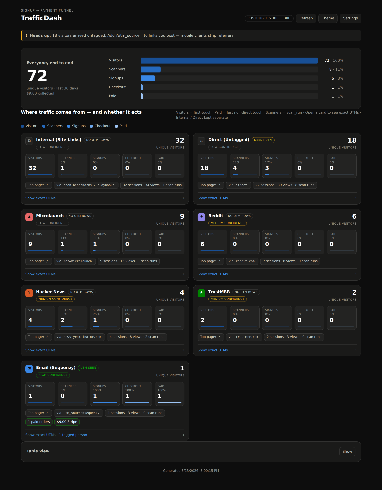
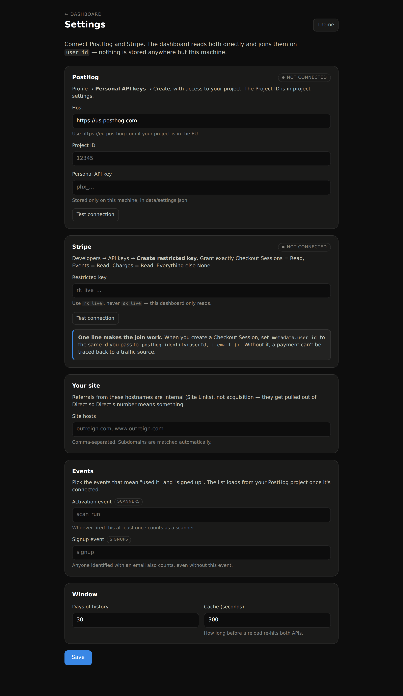

# TrafficDash

Where traffic comes from — and whether it acts.

One page that follows a person all the way through: **where they came from →
signed up → paid**. It reads your PostHog and Stripe accounts directly and joins
them on `user_id`. No warehouse, no ETL, no analytics vendor in the middle.

Every source card is **discovered from your own traffic**. There is no list of
expected sources to keep up to date, and nothing appears with zero visitors — if
a card says Reddit, someone actually arrived from Reddit.



<sub>Screenshot rendered against synthetic events — your instance shows your own sources.</sub>

## Run it

```bash
npm start          # http://localhost:4317
```

It starts empty and asks you to connect PostHog and Stripe. Open
**http://localhost:4317/settings**, paste your keys, and the dashboard fills in.



```bash
npm run report     # the same numbers, in the terminal
npm test
```

Node 18+. No runtime dependencies.

## Connecting it

### 1. PostHog

Profile → **Personal API keys** → Create, with access to your project. The
Project ID is in project settings. Paste both into Settings and hit **Test
connection** — it reports how many events it can see.

Then, on the site right after signup:

```js
posthog.identify(userId, { email });
```

This is the load-bearing line. `userId` is the join key — whatever it is, it has
to be the same string you hand Stripe in step 3.

### 2. Stripe

Developers → API keys → **Create restricted key**:

| Scope | Access |
| --- | --- |
| Checkout Sessions | Read |
| Events | Read |
| Charges | Read |
| everything else | None |

Use `rk_live`, not `sk_live`. A secret key can write; this dashboard only ever
reads, so don't hand it the ability to do more. If you paste an `sk_` key the
settings page will say so.

### 3. Set the join key when you create Checkout

```js
await stripe.checkout.sessions.create({
  // ...
  metadata: { user_id: userId },   // same id you passed to posthog.identify()
});
```

Without this, a payment cannot be traced back to a traffic source — you know
money arrived and nothing about where it came from. Sessions missing it are
counted and surfaced as a warning rather than dropped, so the breakage is
visible the day it starts.

### 4. Tell it about your own domain

Add your hostnames under **Your site**. Referrals from them become *Internal
(Site Links)* instead of counting as acquisition — which is what stops your own
navigation from inflating Direct.

### 5. Tag your links

When you post a link anywhere, add `?utm_source=…` if you can. Mobile clients
strip referrers, so untagged traffic lands in **Direct (Untagged)** with no way
to tell it apart from someone typing the URL. That's what the "Needs UTM" badge
is telling you.

## How attribution works

Two attributions run at once, which is why the dashboard says so out loud:

- **Visitors / Scanners / Signups → first touch.** What found them.
- **Checkout / Paid / Revenue → last non-direct touch.** What closed them.

The same person can appear on two different cards. That's deliberate — "what
found them" and "what closed them" are different questions, and averaging them
into one number is how attribution dashboards start lying.

Each card carries a **confidence** badge, which is about how much the
attribution can be trusted, not how much traffic there is:

| Confidence | Means |
| --- | --- |
| high | A UTM parameter declared the source. |
| medium | The browser reported a referring domain. |
| low | A `?ref=` convention, an own-domain referrer, or nothing at all. |

**Internal (Site Links)** and **Direct (Untagged)** are kept as residuals, not
channels, and get a neutral chip instead of a source color.

## How sources are discovered

For each person's first touch, in order:

1. **UTM parameters** → that source, high confidence.
2. **Own-domain referrer** → Internal (Site Links).
3. **Any other referring domain** → that domain becomes the source, medium
   confidence.
4. **`?ref=` in the landing URL** → that value, low confidence.
5. **Nothing** → Direct (Untagged).

A small registry in `src/classify.js` maps well-known places (Reddit, Hacker
News, Product Hunt, …) to a nicer label and glyph. It is display polish only —
an unrecognised referrer still gets its own card, named after itself. To rename
one, add an entry to `sourceLabels` in `data/settings.json`:

```json
{ "sourceLabels": { "somesite.dev": { "label": "Some Site", "glyph": "S" } } }
```

Colors are assigned from the source key, not the ranking, so a source keeps its
hue when the leaderboard shuffles. Past eight sources the tail takes the neutral
chip rather than cycling a hue nobody could tell apart.

## Where your keys live

`data/settings.json`, on this machine, `chmod 600`, gitignored. Keys are never
sent back to the browser — the settings page only ever sees a masked stub like
`rk_live_…abcd`, and submitting a blank key field leaves the stored one alone.

There is no auth on the server itself, so run it locally. Don't expose it to the
internet as-is.

## Layout

```
server.js            zero-dependency HTTP server + settings API + static host
src/settings.js      settings file, masking, connection state
src/posthog.js       one HogQL query, aggregated per person
src/stripe.js        Checkout Sessions, paginated
src/classify.js      source discovery + confidence
src/report.js        the join, the two attribution models, color assignment
public/              dashboard + settings page
```

## Notes on the numbers

- **Scanners** is whoever fired your activation event at least once. Set it in
  Settings — until you do, it reads 0 and says so.
- **Signups** is anyone identified in PostHog: an explicit signup event, or an
  email landing on the person via `identify()`.
- Percentages on a card are a share of **that card's own visitors**, not of the
  site total.
- Stripe is optional. Without it, traffic and signups still work; the money
  columns stay empty and the dashboard says why.
- Results cache for the configured number of seconds; **Refresh** forces a
  re-read of both APIs.
